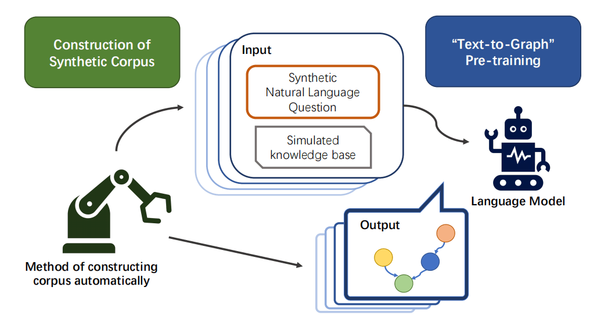
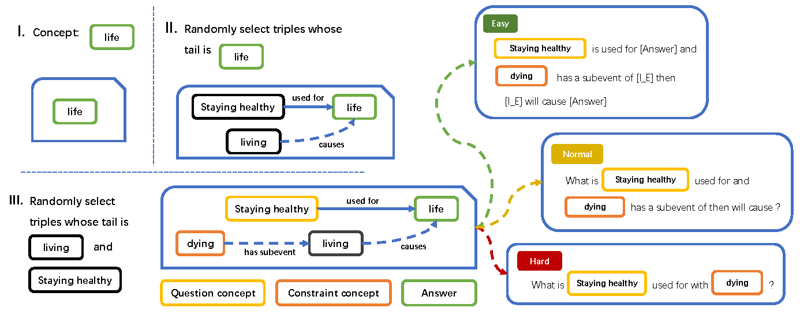

# $EG^3P$: Explanation Graph Generation via Generative Pre-training over Synthetic Graphs
The repository which contains the code and pre-trained models for our paper: Explanation Graph Generation via Generative Pre-training over Synthetic Graphs.(ACL2023-Findings)

## 📑Overview

In this paper, we present $EG^3P$ (for Explanation Graph Generation via Generative Pre-training over Synthetic Graphs), a pre-training structure for explanation graph generation. As shown in the Figure 1, $EG^3P$ contains a pre-training method in the form of "text-to-graph", and an automated process for automatically synthesizing aligning corpus.



<center>Figure 1: Overview of EG3P</center>

In the process of pre-training, we input the synthesized query and simulated knowledge base, and the model will output the reasoning graph. In addition, we have constructed a large number of composite graphs and natural language queries based on external structured knowledge bases, and the specific synthesis process is shown in the following Figure 2.



<center>Figure 2: Construction of the synthetic corpus.</center>

## ▶︎Quickstart

### Prepara the environment

```bash
conda creative -n EG3P python=3.8 
pip install -r requirement.txt
```

### Data and Models
You could check the pre-training data and pre-trained model in the following link: [EG3P_Data_Model](https://pmrdv-my.sharepoint.com/:f:/g/personal/ch_pmrdv_onmicrosoft_com/EtygLGAsGGNBlTUyjko19VcBoxVgr5AYcdys9PD6fMW4wQ?e=NbZeMm)
For detailed info, you could check the `README.md` in the dir of data.


### Training
* Process the data

```bash
bash process_dataset.sh DATASET_PATH MODEL_DIR_PATH
```

where DATASET_PATH is the path of the dataset path(.src/.tgt), and MODEL_DIR_PATH is the path of the model dir.

* Pretraining


```bash
bash pretrain.sh DATASET_PATH MODEL_PATH
```

where DATASET_PATH is the path of the dataset path(processed), and MODEL_PATH is the path of the model file(xx.pt)

* Fine-tuning

```bash
bash finetune.sh TASK_NAME DATASET_PATH MODEL_NAME MODEL_PATH 
```

In the script:

* TASK_NAME: The name of downstream task: ExplaGraphs / CSQA / OBQA
* DATASET_PATH: The path of the dataset path(processed)
* MODEL_NAME: The name of the pre-trained model. (only used for naming the checkpoint_dir)
* MODEL_PATH: The path of the model file(xx.pt)

## Evaluate

``` bash
bash eval.sh DATASET_DIR MODEL_PATH PREDICT_DIR
```

In this script: 

- DATASET_DIR: The path of the dataset path ( processed, and containing the test.src )
- MODEL_PATH: The path of the model file(xx.pt)
- PREDICT_DIR: The path of the result of output
